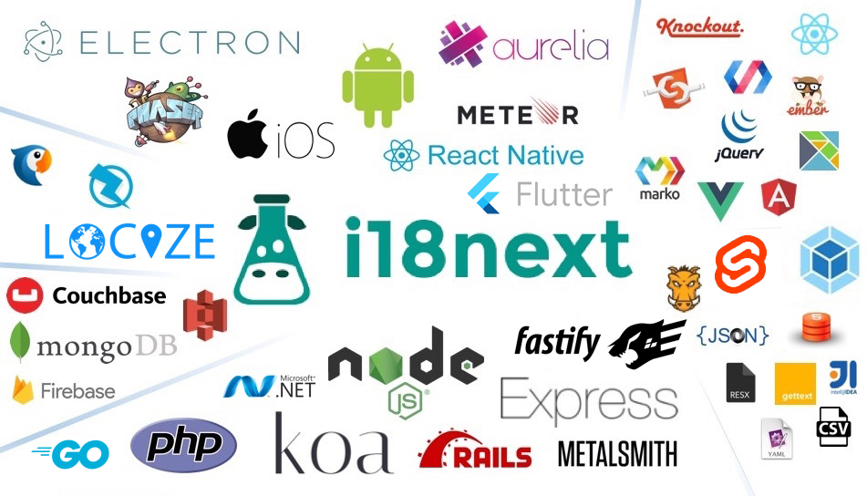

# Introduction

i18next is an **internationalization-framework** written in and for JavaScript. But it's much more than that!

i18next goes beyond just providing the standard i18n features such as ([plurals](translation-function/plurals.md), [context](translation-function/context.md), [interpolation](translation-function/interpolation.md), [format](translation-function/formatting.md)). It provides you with a complete solution to localize your product from web to mobile and desktop.



## learn once - translate everywhere

The i18next-community created integrations for frontend-frameworks such as [React](https://locize.com/blog/react-i18next/), [Angular](https://locize.com/blog/unleash-the-full-power-of-angular-i18next/), [Vue.js](https://locize.com/blog/i18next-vue/) and many more.

But this is not where it ends. You can also use i18next with [Node.js](https://locize.com/blog/how-does-server-side-internationalization-look-like/), [Deno](https://locize.com/blog/i18n-for-deno-with-i18next/), PHP, iOS, Android and [other platforms](overview/supported-frameworks.md).


**Your software is using i18next? -** _Spread the word and let the world know!_

make a tweet... write it on your website... create a blog post... etc...

\
\
&#xNAN;_&#x41;re you working on an open source project and are looking for a way to manage your translations? -_ [_locize_](https://locize.com) _loves the open-source philosophy and may be able to support you._


[Learn more about supported frameworks](overview/supported-frameworks.md)


[Here](https://locize.com/blog/react-i18next/) you'll find a simple tutorial on how to best use [react-i18next](https://react.i18next.com/).\
Some basics of i18next and some cool possibilities on how to optimize your localization workflow.[\
](https://locize.com/blog/react-i18next/)



Do you want to use i18next in [Vue.js](https://github.com/locize/locize-i18next-vue-example)? Check out [this tutorial blog post](https://locize.com/blog/i18next-vue/).




Did you know internationalization is also important on your app's backend? In [this tutorial blog post](https://locize.com/blog/how-does-server-side-internationalization-look-like/) you can check out how this works.[\
](https://locize.com/blog/how-does-server-side-internationalization-look-like/)



Are you still using i18next in [jQuery](https://github.com/i18next/jquery-i18next)? Check out [this tutorial blog post](https://www.locize.com/blog/jquery-i18next).



## Complete solution

Most frameworks leave it to you how translations are being loaded. You are responsible to detect the user language, to load the translations and push them into the framework.

i18next takes care of these issues for you. We provide you with plugins to:

* detect the user language
* load the translations
* optionally cache the translations
* extension, by using post-processing - e.g. to enable sprintf support

[Learn more about plugins and utilities](overview/plugins-and-utils.md)

## Flexibility

i18next comes with strong defaults but it is flexible enough to fulfill custom needs.

* Use moment.js over intl for date formatting?
* Prefer different pre- and suffixes for interpolation?
* Like gettext style keys better?

i18next has you covered!

[Learn more about options](overview/configuration-options.md)

## Scalability

The framework was built with scalability in mind. For smaller projects, having a single file with all the translation might work, but for larger projects this approach quickly breaks down. i18next gives you the option to separate translations into multiple files and to load them on demand.

[Learn more about namespaces](principles/namespaces.md)

## Ecosystem

There are tons of modules built for and around i18next: from extracting translations from your code over bundling translations using webpack, to converting gettext, CSV and RESX to JSON.

* [Learn more about plugins and utils](overview/plugins-and-utils.md)
* [Learn more about frameworks supported](overview/supported-frameworks.md)

## [Localization as a service](https://locize.com)

Through [locize.com](http://locize.com/?utm_source=i18next_com\&utm_medium=gitbook), i18next even provides its own translation management tool: localization as a service.



[Learn more about the enterprise offering](overview/for-enterprises.md)

Imagine you run a successful online business, and you want to expand it to reach customers in different countries. You know that to succeed in those markets, your website or app needs to speak the language and understand the culture of each place.

1. **i18next**: Think of 'i18next' as a sophisticated language expert for your website or app. It's like hiring a team of translators and cultural experts who ensure that your online business is fluent in multiple languages. It helps adapt your content, menus, and messages to fit perfectly in each target market, making your business more appealing and user-friendly.
2. **locize**: Now, 'locize' is your efficient manager in charge of organizing and streamlining the translation process. It keeps all your language versions organized and ensures they're always accurate and up-to-date. So, if you want to introduce a new product or promotion, locize helps you do it seamlessly in all the languages you operate in, saving you time and resources.

Together, 'i18next' and '[locize](https://locize.com)' empower your business to effortlessly reach international audiences. They help you speak the language of your customers, making your business more accessible, relatable, and successful in global markets.
