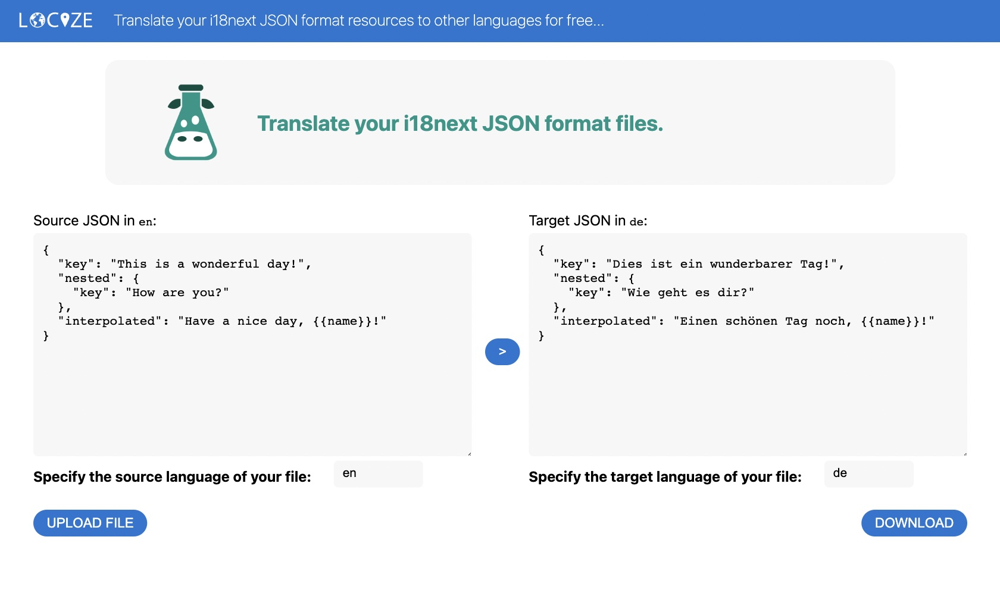

# FAQ

## Misc

### **i18next is awesome. How can I support the project?**

_There are a lot of ways to support us. Make a PR for a feature requested. Improve the documentation. Help others to get started. Spread the word._

_Further you could try_ [_locize.com_](http://locize.com) _- our localization as a service offering. It's like donating to i18next but with additional benefits for you - like saving hours of time translating your project._

## Loading issues

### **I don't see my translations!!!**

_Try setting_ `debug: true` _on init and check the console log. There is rather sure a warning for unable to resolve the loadPath or invalid json. Check if the translation files are accessible via browser._

## Translation

### **How to translate the resource files?**

<figure><figcaption><p><a href="https://translate.i18next.com/">https://translate.i18next.com</a></p></figcaption></figure>

For a quick and dirty machine translation you may have a look at [this free translator](https://translate.i18next.com).\
But in general we suggest to use a smart Translation Management Service like [locize](https://locize.com) to translate your i18next resources.

For professional translations we advice you to work with [human translators](https://docs.locize.com/guides-tips-and-tricks/working-with-translators). Or at least proofread the results coming from machine translations.

### **How do i know which plural suffix i have to use?**

_On the_ [_plural page_](../translation-function/plurals.md) _there is a tool to get them._

_Or try_ [_translation-check_](https://github.com/locize/translation-check)_, it shows an overview of your translations in a nice UI. It shows also the appropriate plural forms._

_Or you use a smart translation management system, like_ [_locize_](https://locize.com)_._


### **Why are my plural keys not working?**

_Are you seeing this warning in the development console?_

> i18next::pluralResolver: Your environment seems not to be Intl API compatible, use an Intl.PluralRules polyfill. Will fallback to the compatibilityJSON v3 format handling.

_With v21 we_ streamlined the suffix with the one used in the [Intl API](https://developer.mozilla.org/en-US/docs/Web/JavaScript/Reference/Global_Objects/Intl/PluralRules/PluralRules).

_In environments where the_ [_Intl.PluralRules_](https://developer.mozilla.org/en-US/docs/Web/JavaScript/Reference/Global_Objects/PluralRules) _API  is not available (like older Android devices), you may need to_ [_polyfill_](https://github.com/eemeli/intl-pluralrules) _the_ [_Intl.PluralRules_](https://developer.mozilla.org/en-US/docs/Web/JavaScript/Reference/Global_Objects/PluralRules) _API._\
_In case it is not available it will fallback to the_ [_i18next JSON format v3_](../misc/json-format.md#i-18-next-json-v3) _plural handling. And if your json is already using the new suffixes, your plural keys will probably not be shown._

_tldr;_

```shell
npm install intl-pluralrules
```

```javascript
import 'intl-pluralrules'
```

### How should the language codes be formatted?

_Theoretically, you're not bound to any specific language code format, but if you want to make use of all the in built language features, like proper_ [_pluralization_](../translation-function/plurals.md) _and correct_ [_fallback resolution_](../principles/fallback.md#language-fallback)_, we strongly suggest to use the following iso norm (BCP 47 language tag):_

`lng-(script)-REGION-(extensions)`\
\
&#xNAN;_&#x69;.e._

* _en, en-US or en-GB_
* _zh, zh-HK or zh-Hant-HK_

_Other examples are listed here:_ [_https://www.iana.org/assignments/language-tags/language-tags.xhtml_](https://www.iana.org/assignments/language-tags/language-tags.xhtml)

_And more information about the format can be found here:_ [_https://www.w3.org/International/articles/language-tags/_](https://www.w3.org/International/articles/language-tags/)


As soon as you use the dash character `-` the language codes are tried to be formatted with `Intl.getCanonicalLocales`.


## Process

### **How do I keep overview over my translation progress?**

_Try_ [_translation-check_](https://github.com/locize/translation-check)_, it shows an overview of your translations in a nice UI. Check which keys are not yet translated._

_If you need more, it might be time to use a_ [_translation management tool_](https://locize.com)_._

### **How to handle with changes in e2e tests?**

_For e2e tests a good tactic is to set language to_ `cimode` _on init. This will set i18next to always return the key on calling_ `i18next.t`_. Want to add the namespace to returned value change_ `appendNamespaceToCIMode: true` _on init._

### **How to use i18next in serverless environments?**

Due to how serverless functions work, you cannot guarantee that a cached version of your data is available. Serverless functions are short-lived, and can shut down at any time, purging any in-memory or filesystem cache. This may be an acceptable trade-off, but sometimes it isn't acceptable.

Because of this we suggest to not use a remote backend and to download the translations and package them with your serverless function.


Read more about this topic, [here](https://locize.com/blog/i18n-serverless/).[\
](https://locize.com/blog/how-does-server-side-internationalization-look-like/)[.jpg>)](https://locize.com/blog/i18n-serverless/)

