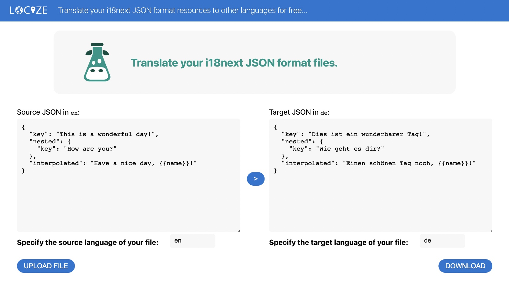
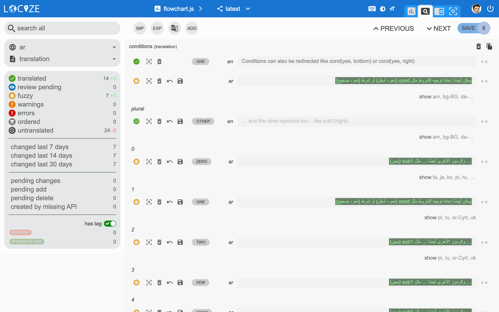

# FAQ

## Misc

### **i18next is awesome. How can I support the project?**

_There are a lot of ways to support us. Make a PR for a feature requested. Improve the documentation. Help others to get started. Spread the word._

_You can support the future of i18next by using_ [_Locize_](https://www.locize.com/i18next?utm_source=i18next_com\&utm_medium=gitbook\&utm_campaign=how_to_faq)_. It’s our 'Localization as a Service' offering that funds the development of this open-source ecosystem. With our **Free plan**, you can now support the project even on smaller hobby sites at no cost, while benefiting from a professional translation workflow._

## Loading issues

### **I don't see my translations!!!**

_Try setting_ `debug: true` _on init and check the console log. There is rather sure a warning for unable to resolve the loadPath or invalid json. Check if the translation files are accessible via browser._

## Translation

### **How to translate the resource files?**

<figure><figcaption><p><a href="https://translate.i18next.com/">https://translate.i18next.com</a></p></figcaption></figure>

For a quick and dirty machine translation you may have a look at [this free translator](https://translate.i18next.com).\
But in general we suggest to use a smart Translation Management Service like [locize](https://www.locize.com/i18next?utm_source=i18next_com\&utm_medium=gitbook\&utm_campaign=how_to_faq) to translate your i18next resources.

For professional translations we advice you to work with [human translators](https://www.locize.com/docs/guides/working-with-translators?utm_source=i18next_com\&utm_medium=gitbook\&utm_campaign=how_to_faq). Or at least proofread the results coming from machine translations.

### **How to check the translation files for missing or broken translations?**

Use the free [i18n health check](https://translate.i18next.com/health-check): drop in your JSON locale files and it instantly reports missing translations, duplicate source values and interpolation placeholder mismatches. Everything runs in your browser, nothing is uploaded.

### **How do i know which plural suffix i have to use?**

_On the_ [_plural page_](../translation-function/plurals.md) _there is a tool to get them._

_Or try_ [_translation-check_](https://github.com/locize/translation-check)_, it shows an overview of your translations in a nice UI. It shows also the appropriate plural forms._

_Or you use a smart translation management system, like_ [_locize_](https://www.locize.com/i18next?utm_source=i18next_com\&utm_medium=gitbook\&utm_campaign=how_to_faq)_._



### **Why are my plural keys not working?**

_Are you seeing this error in the development console?_

> No Intl support, please use an Intl polyfill!

i18next uses the [Intl.PluralRules](https://developer.mozilla.org/en-US/docs/Web/JavaScript/Reference/Global_Objects/PluralRules) API to resolve plural forms. Since **v24** the Intl API is mandatory: there is no fallback to the old JSON v3 plural handling anymore. In an environment without `Intl.PluralRules`, i18next logs the error above and degrades to a minimal English-style rule (`_one`/`_other` only), so languages with more plural forms (e.g. Russian, Arabic, Polish) will show wrong or missing plurals.

The fix is a 2-line [polyfill](https://github.com/eemeli/intl-pluralrules):

```shell
npm install intl-pluralrules
```

```javascript
import 'intl-pluralrules'
```


**React Native:** the Hermes engine still does not implement `Intl.PluralRules`, so the polyfill above is required in every React Native app that uses plurals.


_Historical note: on i18next v21-v23 the same situation produced the warning "Your environment seems not to be Intl API compatible ... Will fallback to the compatibilityJSON v3 format handling", and `compatibilityJSON: 'v3'` could be used as an escape hatch. That option was removed in v24; the polyfill is the only fix on current versions._

### How should the language codes be formatted?

_Theoretically, you're not bound to any specific language code format, but if you want to make use of all the in built language features, like proper_ [_pluralization_](../translation-function/plurals.md) _and correct_ [_fallback resolution_](../principles/fallback.md#language-fallback)_, we strongly suggest to use the following iso norm (BCP 47 language tag):_

`lng-(script)-REGION-(extensions)`\
\
&#xNAN;_&#x69;.e._

* _en, en-US or en-GB_
* _zh, zh-HK or zh-Hant-HK_

_Other examples are listed here:_ [_https://www.iana.org/assignments/language-tags/language-tags.xhtml_](https://www.iana.org/assignments/language-tags/language-tags.xhtml)

_And more information about the format can be found here:_ [_https://www.w3.org/International/articles/language-tags/_](https://www.w3.org/International/articles/language-tags/)


As soon as you use the dash character `-` the language codes are tried to be formatted with `Intl.getCanonicalLocales`.


### How do I get the current language?

Use `i18next.resolvedLanguage`:

```javascript
i18next.resolvedLanguage // 'en'
```

The three related properties differ:

* `i18next.language`: the language as set/detected, e.g. `de-CH`
* `i18next.resolvedLanguage`: the language actually used for the loaded translations after fallback resolution, e.g. `de` — this is usually what you want for UI (language switchers, `lang` attributes)
* `i18next.languages`: the full fallback chain, e.g. `['de-CH', 'de', 'en']`

In react-i18next you get the instance from the hook: `const { i18n } = useTranslation()`.

### Why does my app keep switching back to a previously detected language?

[i18next-browser-languageDetector](https://github.com/i18next/i18next-browser-languageDetector) **caches** the detected language in `localStorage` (and optionally cookies) by default. A language detected or chosen once will win over a changed `fallbackLng` or a different browser setting on the next visit.

To change this, configure the detector's `caches` option:

```javascript
i18next.init({
  detection: {
    caches: [] // disable caching entirely, always re-detect
    // or: caches: ['cookie']
  }
});
```

During development you can simply clear the `i18nextLng` entry from `localStorage`. Calling `i18next.changeLanguage(lng)` updates the cache; `i18next.changeLanguage(undefined)` re-runs detection.

### Is i18next overkill for a small site?

i18next can start as small as a naive "fetch a JSON file" approach, without any plugins:

```javascript
import i18next from 'i18next';

await i18next.init({
  lng: 'en',
  resources: {
    en: { translation: { welcome: 'Welcome' } },
    de: { translation: { welcome: 'Willkommen' } }
  }
});

i18next.t('welcome'); // -> 'Welcome'
```

That is the whole setup: no backend, no detector, no framework binding. What you get over a hand-rolled `fetch`-JSON helper, without writing it yourself: correct [plural rules](../translation-function/plurals.md) for every language (not just `count === 1`), a [fallback chain](../principles/fallback.md) so missing keys never render blank, [interpolation with escaping](../translation-function/interpolation.md), and [Intl-based formatting](../translation-function/formatting.md). When the project grows, the plugin ecosystem (lazy loading, detection, framework bindings) attaches to the same setup instead of a rewrite.

### Can I use my source text as the key (gettext style)?

Yes. Nothing forces abstract keys like `header.title`; natural-language keys work:

```javascript
i18next.init({
  nsSeparator: false, // if your texts contain ':'
  keySeparator: false // if your texts contain '.'
});

i18next.t('Welcome to our application'); // key === English source text
```

Combined with `saveMissing` (or [i18next-cli extract](https://github.com/i18next/i18next-cli) with `defaultValue`), the English text fills the source catalog automatically, and translators translate from the key itself. Trade-off: changing the source wording changes the key (invalidating existing translations), and very long texts make unwieldy keys — which is why abstract keys remain the default recommendation for larger apps.

## Process

### **How do I keep overview over my translation progress?**

_Try_ [_translation-check_](https://github.com/locize/translation-check)_, it shows an overview of your translations in a nice UI. Check which keys are not yet translated._

_If you need more, it might be time to use a_ [_translation management tool_](https://www.locize.com/i18next?utm_source=i18next_com\&utm_medium=gitbook\&utm_campaign=how_to_faq)_._

### **How to handle with changes in e2e tests?**

_For e2e tests a good tactic is to set language to_ `cimode` _on init. This will set i18next to always return the key on calling_ `i18next.t`_. Want to add the namespace to returned value change_ `appendNamespaceToCIMode: true` _on init._

### **How to use i18next in serverless environments?**

Due to how serverless functions work, you cannot guarantee that a cached version of your data is available. Serverless functions are short-lived, and can shut down at any time, purging any in-memory or filesystem cache. This may be an acceptable trade-off, but sometimes it isn't acceptable.

Because of this we suggest to not use a remote backend and to download the translations and package them with your serverless function.


Read more about this topic, [here](https://www.locize.com/blog/i18n-serverless/?utm_source=i18next_com\&utm_medium=gitbook\&utm_campaign=how_to_faq).[<br>](https://www.locize.com/blog/how-does-server-side-internationalization-look-like/?utm_source=i18next_com\&utm_medium=gitbook\&utm_campaign=how_to_faq)[.jpg>)](https://www.locize.com/blog/i18n-serverless/?utm_source=i18next_com\&utm_medium=gitbook\&utm_campaign=how_to_faq)

