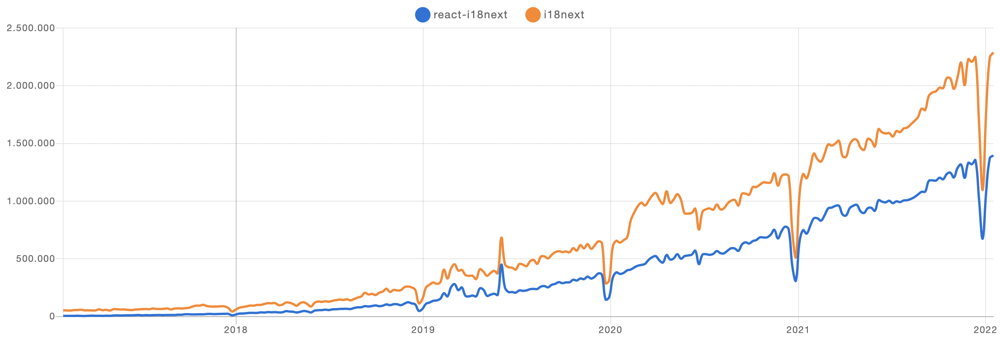

# The history of i18next

## How all began - back in 2011

All started back in 2011 when we were in search for an internationalization library that meets our demand - allowing to run both on server side [Node.js](https://nodejs.org) and on our client side single page applications.

I18next was born and fastly grown to one of the most used frameworks for translating web applications and in [Node.js](https://nodejs.org). The response of the community was amazing and a fast growing [ecosystem](../overview/supported-frameworks.md) established itself around i18next.

## V2

With v2 of i18next, released in 2015, we completely rebuild i18next to be as extensible as possible.


Since v1 all newer releases can be dropped in as a replacement for v1 by just adding a minimal compatibility layer. The v1 API is still actively tested, [here](https://github.com/i18next/i18next/blob/master/test/backward/v1.11.1.compat.js).


Shortly after the i18next v2 release in 2015, another big community driven i18next extension was released: [react-i18next](https://react.i18next.com/).

## Internationalization (i18n) is not enough

Our community provided us with great feedback. Out of that response and our own experiences we learnt providing instrumentation for doing proper internationalization just is not enough.

Helping developers to get their applications translated is great - but there is more to it.

* How do you integrate any translation services / agencies?
* How do you keep track of new or removed content?
* How do you handle proper versioning?
* How do you deploy translation changes without deploying your complete application?
* and a lot more...

### [locize](https://www.locize.com/i18next?utm_source=i18next_com\&utm_medium=gitbook\&utm_campaign=misc_the_history_of_i18next) to the rescue

Having created the foundation with i18next it was a long journey to [**localization as a service**](https://www.locize.com/i18next?utm_source=i18next_com\&utm_medium=gitbook\&utm_campaign=misc_the_history_of_i18next).

* [Easy to integrate](https://www.locize.com/docs/integration/instrumenting-your-code?utm_source=i18next_com\&utm_medium=gitbook\&utm_campaign=misc_the_history_of_i18next#i18next-full-featured-integration)
* Continuous deployment? [Continuous localization](https://www.locize.com/how-it-works?utm_source=i18next_com\&utm_medium=gitbook\&utm_campaign=misc_the_history_of_i18next#continuouslocalization) with a [CDN](https://www.locize.com/docs/cdn?utm_source=i18next_com\&utm_medium=gitbook\&utm_campaign=misc_the_history_of_i18next)!
* Manage the translation files with ease
* [Order professional translations](https://www.locize.com/customers?utm_source=i18next_com\&utm_medium=gitbook\&utm_campaign=misc_the_history_of_i18next)
* Analytics & Statistics
* [Profit from a content delivery network](https://www.locize.com/docs/cdn?utm_source=i18next_com\&utm_medium=gitbook\&utm_campaign=misc_the_history_of_i18next)
* [Versioning of your translations](https://www.locize.com/docs/versioning?utm_source=i18next_com\&utm_medium=gitbook\&utm_campaign=misc_the_history_of_i18next)
* [Automatic and On-Demand Machine Translation](https://www.locize.com/docs/automatic-translation?utm_source=i18next_com\&utm_medium=gitbook\&utm_campaign=misc_the_history_of_i18next)
* [Risk free: Take your data with you](https://www.locize.com/docs/general-questions/how-is-locize-different-from-the-alternatives?utm_source=i18next_com\&utm_medium=gitbook\&utm_campaign=misc_the_history_of_i18next#no-service-lock-in)
* [Transparent and fair pricing](https://www.locize.com/pricing?utm_source=i18next_com\&utm_medium=gitbook\&utm_campaign=misc_the_history_of_i18next)
* and a lot more...


🙏 **The best way to directly support the future of i18next is to use** [**locize**](https://www.locize.com/i18next?utm_source=i18next_com\&utm_medium=gitbook\&utm_campaign=misc_the_history_of_i18next)**.** 💙


> _<\<We aim to simplify localization, making it an efficient process that aligns with the ever-evolving demands of the modern business landscape.>>_ [read the full interview](https://www.websiteplanet.com/blog/interview-locize/).
