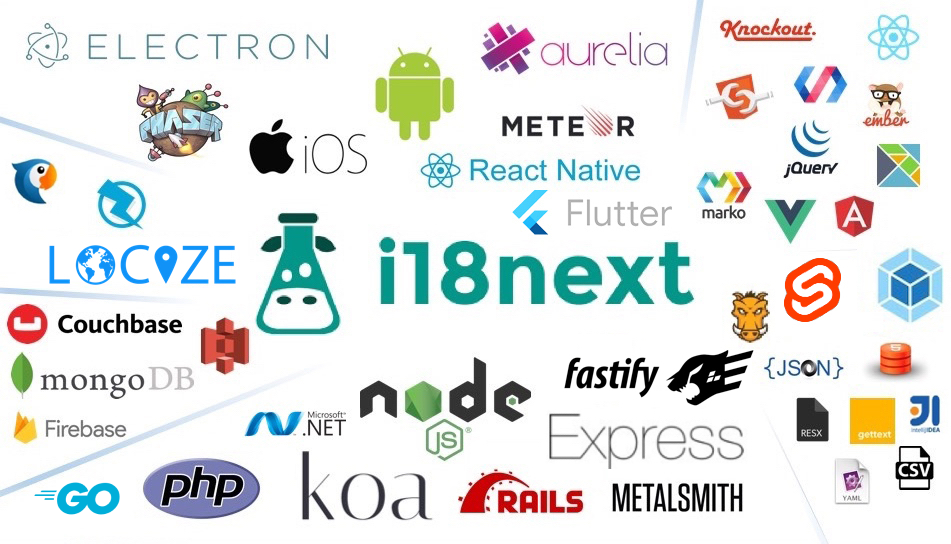

# Plugins and Utils

## Plugins and Utils

### i18n formats

While the i18next format \(JSON based\) is the preferred solution and widely supported in translation management tools like [locize.com](https://locize.com), you might prefer another exciting format, like:

| **name** | **format** | **description** |
| :--- | :--- | :--- |
| [i18next-fluent](https://github.com/i18next/i18next-fluent) | fluent | i18nFormat plugin to use mozilla [fluent format](https://projectfluent.org/) with i18next |
| [i18next-icu](https://github.com/i18next/i18next-icu) | ICU | i18nFormat plugin to use ICU format with i18next based on [yahoo/intl-messageformat](https://github.com/yahoo/intl-messageformat) |
| [i18next-polyglot](https://github.com/i18next/i18next-polyglot) | polyglot | i18nFormat plugin to use [airbnb/polyglot.js](https://github.com/airbnb/polyglot.js) format with i18next |

### extraction tools

| **name** | **description** |
| :--- | :--- |
| [i18next-scanner](http://i18next.github.io/i18next-scanner) | Scan your code, extract translation keys/values, and merge them into i18n resource files. |
| [i18next-parser](https://github.com/i18next/i18next-parser) | A simple command line and gulp plugin that lets you parse your code and extract the translations keys in it. |
| [babel-plugin-i18next-extract](https://github.com/gilbsgilbs/babel-plugin-i18next-extract) | A babel plugin that can extract keys in JSONv3 format. |

### utils

| **util** | **type** | **description** |
| :--- | :--- | :--- |
| [i18next-gettext-converter](https://github.com/i18next/i18next-gettext-converter) | converter | Converts gettext .mo or .po to 18next json format and vice versa. |
| [csv2i18next](https://github.com/tmorozov/csv2i18next) | converter | Convert CSV files to JSON & YAML for i18next.js |
| [i18next-json-csv-converter](https://github.com/andraaspar/i18next-json-csv-converter) | converter | Convert between CSV files and JSON format for i18next |
| [resx2i18next](https://github.com/rolandpd/resx2i18next) | converter | Convert ResX-files to json resources compatible with i18next |
| [i18nextResourceGenerator](https://github.com/DREEBIT/i18nextResourceGenerator) | extractor | Intellij IDEA Plugin for i18next resource generation |
| [aurelia-i18next-parser](https://github.com/gooy/aurelia-i18next-parser) | extractor | Extracts i18n keys and values from source files. |
| [grunt-i18next](https://github.com/i18next/grunt-i18next) | bundler | bundle language resource files for i18next |
| [i18next-po-loader](https://github.com/queicherius/i18next-po-loader) | bundler | Load gettext PO files as i18next format directly in webpack |
| [i18next-loader](https://github.com/kamilglod/i18next-loader) | bundler | webpack loader that can translate your code and generate bundle per each language |
| [@alienfast/i18next-loader](https://github.com/alienfast/i18next-loader) | bundler | This webpack loader generates the resources structure necessary for i18next. The structure is webpacked with the client bundle at build time, thus avoiding loading any language resources via extra HTTP requests. |
| [webpack i18next-resource-store-loader](https://github.com/atroo/i18next-resource-store-loader) | bundler | This loader generates the resStore config needed for i18next to avoid loading language resources via extra HTTP requests. It generates this config given a directory. |
| [ya-i18next-webpack-plugin](https://github.com/Perlmint/ya-i18next-webpack-plugin) | bundler | Yet another i18next webpack plugin. This plugin collects keys from webpack parsing phase, saves missing translations into specified path, copies translation files. |
| [rollup-plugin-i18next-conv](https://github.com/perrin4869/rollup-plugin-i18next-conv) | bundler/converter | Import .po files with rollup |
| [i18next-static-analysis](https://github.com/Cellule/i18next-static-analysis) | util | analyse statically your code to find calls to i18next and validates them for all your supported languages |
| [i18next-json-sync](https://github.com/jwbay/i18next-json-sync) | util | Keep i18next JSON resource files in sync with source language file |
| [eslint-plugin-i18next](https://github.com/edvardchen/eslint-plugin-i18next) | util | Make sure that all text shown are translated |

### services

| **name** | **description** |
| :--- | :--- |
| [locize](http://locize.com) | localization as a service. Solves your localization process using i18next. |
| [spacetranslate](https://spacetranslate.com) | Simple Translation Service at Scale. Solves your localization process using i18next. |

### backend extenders

| **backend** | **description** |
| :--- | :--- |
| [chained backend](https://github.com/i18next/i18next-chained-backend) | combine multiple of the existing backends for fallback and caching scenarios |
| [i18next-multiload-backend-adapter](https://github.com/i18next/i18next-multiload-backend-adapter) | enable another backend's multiload behaviour of loading multiple lng-ns combinations with one request. This behaviour was removed from i18next &gt;=v11.0.0 and could be enabled again by using this adapter |

### backends

| **backend** | **description** |
| :--- | :--- |
| [localstorage backend](https://github.com/i18next/i18next-localstorage-backend) | This is a i18next cache layer to be used in the browser. It will load and cache resources from localStorage and can be used in combination with the [chained backend](https://github.com/i18next/i18next-chained-backend). |
| [async storage backend](https://github.com/timbrandin/i18next-async-storage-backend) | This is a i18next cache layer to be used in react native. It will load and cache resources from AsyncStorage and can be used in combination with the [chained backend](https://github.com/i18next/i18next-chained-backend). |
| [xhr backend](https://github.com/i18next/i18next-xhr-backend) | backend layer for i18next using browsers xhr |
| [fetch backend](https://github.com/perrin4869/i18next-fetch-backend) | backend layer for i18next using browsers fetch |
| [fluent backend](https://github.com/i18next/i18next-fluent-backend) | backend to load [fluent syntax](https://projectfluent.org/) .ftl files via xhr |
| [keys ondemand](https://github.com/kingatlas/i18next-keys-ondemand) | fetch missing keys on demand |
| [i18next.gettext](https://github.com/palamccc/i18next.gettext) | gettext backend of i18next |
| [nodejs filesystem](https://github.com/i18next/i18next-node-fs-backend) | node.js backend layer for i18next using fs module to load resources from filesystem |
| [nodejs filesystem \(sync\)](https://github.com/sallar/i18next-sync-fs-backend) | node.js backend layer for i18next using fs module to load resources synchronous from filesystem |
| [nodejs remote](https://github.com/i18next/i18next-node-remote-backend) | node.js backend layer for i18next using request module to load resources from another server |
| [nodejs mongodb](https://github.com/gian788/i18next-node-mongodb-backend) | i18next node.js backend layer for i18next using mongodb |
| [nodejs couchbase](https://github.com/kvaillant/i18next.couchbase) | i18next node.js backend layer for i18next using couchbase |
| [Zanata nodejs backend](https://bitbucket.org/tagoh/i18next-node-zanata-backend) | i18next node.js backend layer for [Zanata](http://zanata.org) |
| [i18next-firebase-backend](https://github.com/inteligator/i18next-firebase-backend) | i18next Backend Using Firebase |
| [i18next-smart-bucket-backend](https://github.com/nekuz0r/i18next-smart-bucket-backend) | i18next backend for smart-bucket |
| [locize backend](https://github.com/locize/i18next-locize-backend) | backend layer for [locize.com - localization as a service](http://locize.com) |
| [service backend](https://github.com/timbrandin/i18next-service-backend) | backend layer for external services such as [spacetranslate.com - Simple Translation Service at Scale](https://spacetranslate.com) and [locize.com - localization as a service](http://locize.com). |
| [locize nodejs backend](https://github.com/locize/i18next-node-locize-backend) | backend layer for [locize.com - localization as a service](http://locize.com) |
| [service node backend](https://github.com/timbrandin/i18next-node-service-backend) | backend layer for external services such as [spacetranslate.com - Simple Translation Service at Scale](https://spacetranslate.com) and [locize.com - localization as a service](http://locize.com). |

### language detector

| **language** **detector** | **description** |
| :--- | :--- |
| [browser](https://github.com/i18next/i18next-browser-languageDetector) | language detector used in browser environment for i18next |
| [nodejs express](https://github.com/i18next/i18next-express-middleware) | language detector for express.js \(nodejs\). |
| [nodejs koa](https://github.com/lxzxl/koa-i18next-detector) | A i18next language detecting plugin for Koa framework. |
| [react native](https://github.com/DylanVann/i18next-react-native-language-detector) | language detector for React Native. |
| [react native Async Storage](https://github.com/0xClpz/i18next-react-native-async-storage) | language detector for React Native that saves the user's choice in Async Storage, used for persistance. |
| [electron](https://github.com/neruchev/i18next-electron-language-detector) | language detector for electron apps. |

### post processors

| **post** **processor** | **description** |
| :--- | :--- |
| [sprintf post processor](https://github.com/i18next/i18next-sprintf-postProcessor) | sprintf post processor for i18next. |
| [interval plurals](https://github.com/i18next/i18next-intervalPlural-postProcessor) | interval based plurals like. "One Item", "A few items", "A lot of items" |
| [i18next-react-postprocessor](https://github.com/orzechowskid/i18next-react-postprocessor) | embed React elements inside your i18next translation strings |
| [i18next-korean-postposition-processor](https://github.com/Perlmint/i18next-korean-postposition-processor) | i18next post-processor for processing korean postposition |
| [i18next-pseudo](https://github.com/MattBoatman/i18next-pseudo) | i18next post-processor for pseudolocalization of strings |

### loggers

Only the integrated console logger is available for now.

### Create your own plugin

Want to create your own plugins? Learn more [here](../misc/creating-own-plugins.md).

