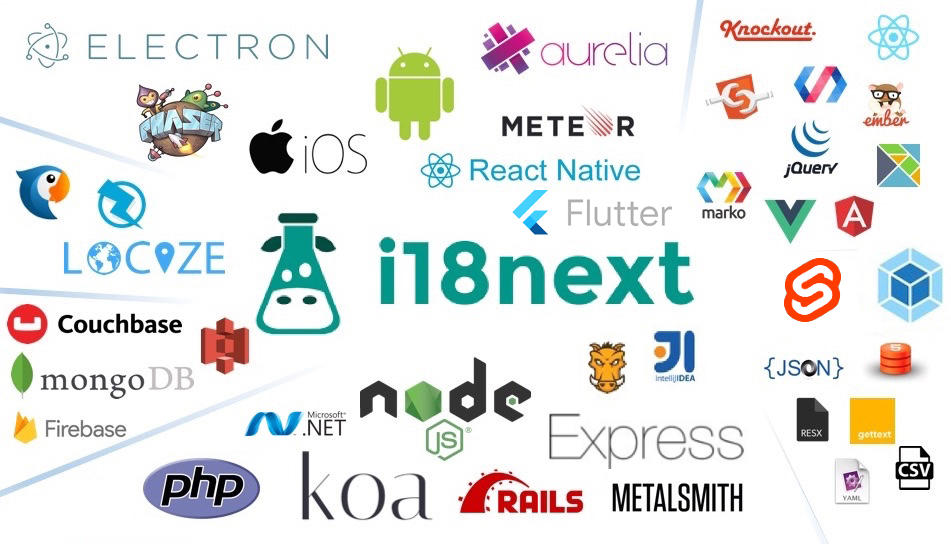

# Supported Frameworks

This list is not officially maintained; information here is contributed by the library maintainers themselves. Consult their GitHub page for details on issues and implementation. Lastly, some of those libraries might stop being updated without further notice, while others warn it in their pages. In the latter scenario, they're tagged as _deprecated_ below.

| Framework | Home | Extra details |
| :--- | :--- | :--- |
| React | [react-i18next](https://github.com/i18next/react-i18next) |  |
| Next.js | [next-i18next](https://github.com/isaachinman/next-i18next) | The easiest way to translate your Next.js apps |
| Next.js | [next-right-now](https://github.com/UnlyEd/next-right-now) | Flexible production-grade boilerplate with Next.js 9 and Zeit Now, with pre-configured Sentry, cookies, Amplitude, Emotion, FontAwesome, GraphQL/GraphCMS \(Apollo\), Bootstrap \(Reactstrap\), **i18next \(Locize\)**, Jest, Cypress \(E2E tests\) and CI/CD \(GH Actions\), with full TypeScript support and support for B2B multi-tenants web apps \(monorepo\) |
| AngularJS | [ng-i18next](https://github.com/i18next/ng-i18next) | Angular1/2 provider, directive and filter |
| Angular | [ng2-i18next](https://github.com/actimeo/ng2-i18next) _\(actimeo\)_ | Angular2 service and directive |
| Angular | [angular-i18next](https://github.com/Romanchuk/angular-i18next) _\(Romanchuk\)_ | Angular 2.0+ integration \(service, pipes, events\) |
| Vue.js | [vue-i18next](https://github.com/rse/vue-i18next) _\(rse\)_ |  |
| Vue.js | [@panter/vue-i18next](https://github.com/panter/vue-i18next) |  |
| Vue.js | [vue-i18next2](https://github.com/bluelovers/vue-i18next2) _\(bluelovers\)_ |  |
| Omi | [omi-i18n](https://github.com/i18next/omi-i18n) | i18n solution for Omi |
| Inferno | [inferno-i18next](https://www.npmjs.com/package/inferno-i18next) | **\(deprecated/gone\)** Translation utility for Inferno components |
| Elm | [elm-i18next](https://github.com/ChristophP/elm-i18next) |  |
| Node/Deno HTTP server | [http-middleware](https://github.com/i18next/i18next-http-middleware) | Middleware to be used with Node.js web frameworks like Express or Fastify, and also for Deno. |
| Express | [i18next-express-middleware](https://github.com/i18next/i18next-express-middleware) | **\(deprecated\)** Middleware for the Express HTTP server/framework \(Node\) |
| Koa | [koa-i18next-middleware](https://github.com/lxzxl/koa-i18next-middleware) | Middleware for the Koa framework |
| Hapi | [hapi-i18next](https://github.com/kenkouot/hapi-i18next) |  |
| jQuery | [jquery plugin](https://github.com/i18next/jquery-i18next) | Plugin to use i18next on jQuery selectors |
| HTML5 | [loc-i18next](https://github.com/mthh/loc-i18next) | Plugin to use the same API as `jquery-i18next`, but with HTML5 selectors |
| Aurelia | [aurelia-i18next](https://github.com/aurelia/i18n) | An Aurelia-Wrapper |
| Meteor | [i18next-meteor](https://github.com/ckir/i18next-meteor) | i18next repackaged for Meteor |
| Polymer | [i18next-element](https://github.com/Polymer/i18next-element) | **\(deprecated\)** Polymer-friendly interface |
| Ember.js | [ember-i18next](https://github.com/OCTRI/ember-i18next) | Integrates i18next into Ember CLI apps |
| Ember.js | [ember-cli-i18next](https://github.com/recipher/ember-cli-i18next) | Ember CLI addon |
| Knockout.js | [i18next-ko](https://github.com/leMaik/i18next-ko) | KnockoutJS bindings |
| Phaser | [phaser-i18next](https://github.com/orange-games/phaser-i18next) | Plugin for the HTML5 game framework |
| Construct 3 | [c3-i18next](https://github.com/nagyv/c3-i18next/) | Translation plugin for the Construct 3 game software |
| Metalsmith | [metalsmith-i18next](https://github.com/macprog-guy/metalsmith-i18next) | **\(deprecated\)** Metalsmith plugin to easily create multiple localised branches of your site |
| .NET | [I18Next.Net](https://github.com/DarkLiKally/I18Next.Net) | Library based on .NET Standard 2.0 with a rich feature-set like the original i18next, supporting .NET DI and translations; also comes with plugin support |
| .NET | [i18next-net](https://github.com/leonardobaggio/i18next-net) | .NET C\# class |
| PHP | [kopfwelt/i18next-php](https://github.com/Acceptd/i18next-php) | Class for basic i18next functionality. There's also a [fork by Mika-](https://github.com/Mika-/i18next-php) |
| Rails | [i18next-rails](https://github.com/roblander/i18next-rails) | Asset gem containing bundled i18next JavaScript files |
| Rails | [rails-asset-localization](https://github.com/nicolai86/rails-asset-localization) | **\(deprecated\)** Asset pipeline localization using i18next for rails 3.2 & 4 |
| iOS | [i18next-ios](https://github.com/i18next/i18next-ios) |  |
| Android | [i18next-android](https://github.com/i18next/i18next-android) |  |
| Web Components | [kwc-i18next](https://github.com/successk/kwc-i18next) | Web component interfacing i18next |
| Web Components | [i18next-wc](https://github.com/spurreiter/i18next-wc) | Web component interfacing i18next and Intl |
| Marko | [marko-i18next](https://github.com/gunjam/marko-i18next) | Components for Marko templates |
| Virtual DOM | [i18nextify](https://github.com/i18next/i18nextify) | One-liner script to enable i18next on any site not using its own Virtual DOM |
| Handlebars | [handlebars-i18next](https://github.com/UUDigitalHumanitieslab/handlebars-i18next) | Helper that lets you translate inside your templates |
| Handlebars | [handlebars-i18n](https://github.com/fwalzel/handlebars-i18n) | Adds the features of i18next and Intl to Handlebars |

## Supported Environments

i18next supports the two most recent versions of evergreen browsers \(Chrome, Firefox, Safari, etc\). It also runs in Node and Deno.

