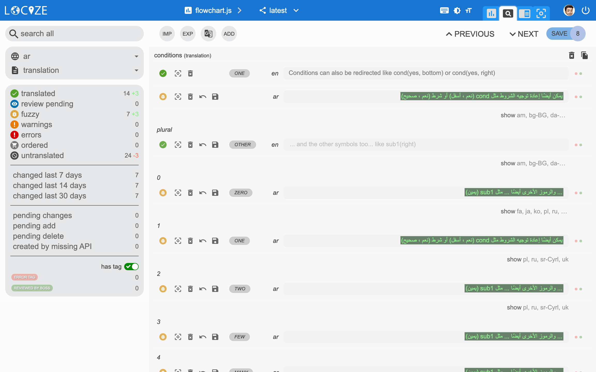

# Plurals

Plural can be combined with interpolation, context, ...

This plurals are streamlines with the one used in the [Intl API](https://developer.mozilla.org/en-US/docs/Web/JavaScript/Reference/Global_Objects/Intl/PluralRules/PluralRules).


Note: The variable name must be `count`.   
And it must be present: `i18next.t('key', {count: 1});`  
There will be **no** fallback to the `'key'` value if count is not provided.



If you need multiple counts, take a look at [nesting](nesting.md#passing-options-to-nestings)


## Singular / Plural

keys

```javascript
{
  "key_one": "item",
  "key_other": "items",
  "keyWithCount_one": "{{count}} item",
  "keyWithCount_other": "{{count}} items"
}
```

sample

```javascript
i18next.t('key', {count: 0}); // -> "items"
i18next.t('key', {count: 1}); // -> "item"
i18next.t('key', {count: 5}); // -> "items"
i18next.t('key', {count: 100}); // -> "items"
i18next.t('keyWithCount', {count: 0}); // -> "0 items"
i18next.t('keyWithCount', {count: 1}); // -> "1 item"
i18next.t('keyWithCount', {count: 5}); // -> "5 items"
i18next.t('keyWithCount', {count: 100}); // -> "100 items"
```


With [v21.0.0](../misc/migration-guide.md#json-format-v4-pluralization) a new [JSON format v4](../misc/json-format.md#i-18-next-json-v4) was introduced that changed the suffixes.  
To convert your existing translations to the new v4 format, have a look at [i18next-v4-format-converter](https://github.com/i18next/i18next-v4-format-converter) or [this web tool](https://i18next.github.io/i18next-v4-format-converter-web/).


## Languages with multiple plurals

Sample uses arabic which has 5 plural forms beside the singular.

keys

```javascript
{
  "key_zero": "zero",
  "key_one": "singular",
  "key_two": "two",
  "key_few": "few",
  "key_many": "many",
  "key_other": "other"
}
```

sample

```javascript
i18next.t('key', {count: 0}); // -> "zero"
i18next.t('key', {count: 1}); // -> "singular"
i18next.t('key', {count: 2}); // -> "two"
i18next.t('key', {count: 3}); // -> "few"
i18next.t('key', {count: 4}); // -> "few"
i18next.t('key', {count: 5}); // -> "few"
i18next.t('key', {count: 11}); // -> "many"
i18next.t('key', {count: 99}); // -> "many"
i18next.t('key', {count: 100}); // -> "other"
```

## How to find the correct plural suffix?

You can use this small utility to get the correct plural suffixes.

[source code](https://jsfiddle.net/6bpxsgd4)

_Or try_ [_translation-check_](https://github.com/locize/translation-check)_, it shows an overview of your translations in a nice UI. It shows also the appropriate plural forms._

#### Or you use a smart translation management system, like [locize](https://locize.com)



## Ordinal plurals

There is also support for ordinal numbers _\(referring to the ordering or ranking of things, e.g. "1st", "2nd", "3rd" in English\)_.

keys

```javascript
// i.e. italian
{
  "key_one": "singular", // cardinal form
  "key_other": "other", // cardinal form
  "key_many": "many" // ordinal form
}
```

sample

```javascript
i18next.t('key', {count: 0}); // -> "other"
i18next.t('key', {count: 1}); // -> "singular"
i18next.t('key', {count: 2}); // -> "other"
i18next.t('key', {count: 11}); // -> "other"
i18next.t('key', {count: 11, ordinal: true}); // -> "many"
```

## Interval plurals

Want to define phrases expressing the number of items lies in a range. Like _a few items_ or _a lot of items_.

You will need to add a post processor: [i18next-intervalplural-postprocessor](https://github.com/i18next/i18next-intervalplural-postprocessor)

```javascript
import i18next from 'i18next';
import intervalPlural from 'i18next-intervalplural-postprocessor';

i18next
  .use(intervalPlural)
  .init(i18nextOptions);
```

keys

```javascript
{
  "key1": "{{count}} item",
  "key1_plural": "{{count}} items",
  "key1_interval": "(1)[one item];(2-7)[a few items];(7-inf)[a lot of items];",
  "key2": "{{count}} item",
  "key2_plural": "{{count}} items",
  "key2_interval": "(1)[one item];(2-7)[a few items];"
}
```

sample

```javascript
i18next.t('key1_interval', {postProcess: 'interval', count: 1}); // -> "one item"
i18next.t('key1_interval', {postProcess: 'interval', count: 4}); // -> "a few items"
i18next.t('key1_interval', {postProcess: 'interval', count: 100}); // -> "a lot of items"

// not matching into a range it will fallback to
// the regular plural form
i18next.t('key2_interval', {postProcess: 'interval', count: 1}); // -> "one item"
i18next.t('key2_interval', {postProcess: 'interval', count: 4}); // -> "a few items"
i18next.t('key2_interval', {postProcess: 'interval', count: 100}); // -> "100 items"
```


Note: The regex for the interval entry has changed in `v3.0.0` of `i18next-intervalPlural-postProcessor` so if you are using the older versions, you need to use the curly braces instead of the bracketes, e.g.:

```javascript
"key2_interval": "(1){one item};(2-7){a few items};"
```


